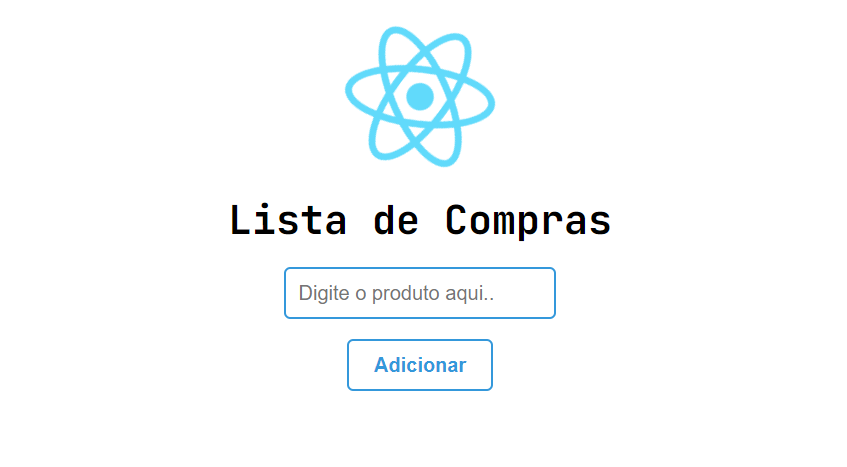

<!-- 

  

 -->

<h2 align="center">
Lista de compras simples em ReactJS 

</h2>

  <a href="#-tecnologias">Tecnologias</a>&nbsp;&nbsp;&nbsp;|&nbsp;&nbsp;&nbsp;
  <a href="#-projeto">Projeto</a>&nbsp;&nbsp;&nbsp;|&nbsp;&nbsp;&nbsp;
  <a href="#-layout">Layout</a>
 

 

  

## 🚀 Tecnologias

Esse projeto foi desenvolvido com as seguintes tecnologias:

- ReactJS
- Styled Components
- Git e Github

## 💻 Projeto

- [Projeto Finalizado](https://gabrielsouza18.github.io/Lista_de_Compras/)

Feito com ♥ by Gabriel
